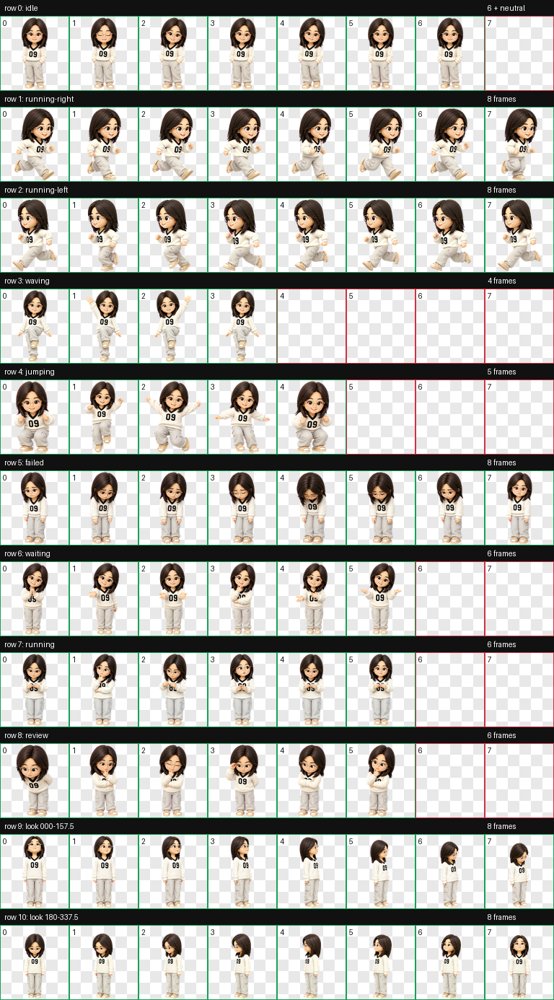

# 付饼 · AAAA 万能大饼

这是一个可直接导入 Codex 的 v2 动态宠物。它包含 9 种常用动作和 16 个视线方向。



## 文件说明

- `pet.json`：宠物名称、介绍和版本配置。
- `spritesheet.webp`：宠物的完整动画图集；必须与 `pet.json` 保持同一目录。

## 导入到另一台电脑

1. 下载或克隆此仓库。
2. 在目标电脑创建宠物目录：

   ```text
   ~/.codex/pets/fubing/
   ```

3. 将本仓库中的 `pet.json` 和 `spritesheet.webp` 一起复制到该目录。
4. 刷新或重新打开 Codex；宠物列表中会显示“付饼”。

导入后的目录应为：

```text
~/.codex/pets/fubing/
├── pet.json
└── spritesheet.webp
```

## 配置

此宠物使用 `spriteVersionNumber: 2`，因此图集为 8 列 × 11 行。请勿单独替换其中一个文件，或修改图集尺寸。
